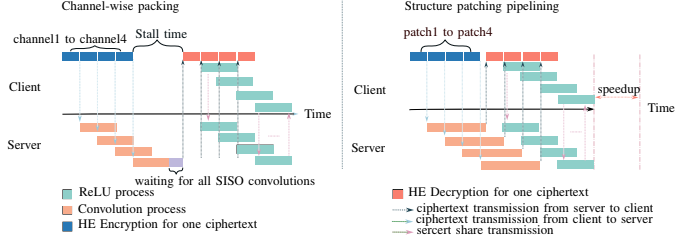

# SPOT: Structure Patching and Overlap Tweaking



SPOT is a privacy-preserving MLaaS framework that pipelines secure inference by splitting inputs into patches and tweaking overlap. Each patch can be processed independently end‑to‑end (Conv → ReLU) without waiting for other patches, enabling streaming and parallel evaluation. A baseline channel‑packing path computes the full Conv first and then runs ReLU, demonstrating stall behavior.

Overview
- Patch planning: `src/SPOT/patching.h`, `src/SPOT/patching.cpp`
- HE Conv and MPC ReLU integration: existing modules under `src/LinearHE` and `src/NonLinear`
- Minimal demo: `tests/test_spot_minconvrelu.cpp`
- Binary demos: `build/bin/spot`, `build/bin/spot_minconvrelu`

Build
1. From the repo root:
   - `cmake -S . -B build -DCMAKE_PREFIX_PATH=/cis/home/zwang/yuanzhong/SEAL/native/build/install`
   - `cmake --build build -j`

Minimal Demo (two terminals)
- Terminal A (server):
  - `cd build/bin`
  - `./spot_minconvrelu r=1 p=32020 ph=4 pw=4 ov=2 np=10`
- Terminal B (client):
  - `cd build/bin`
  - `./spot_minconvrelu r=2 p=32020 ph=4 pw=4 ov=2 np=10`

What it prints
- SPOT (pipelined): per‑patch ReLU start/end timestamps and cumulative inputs, plus total runtime for N patches
- Baseline (channel packing): single ReLU start/end after all patch Conv threads complete, plus total runtime for the same N patches

Notes
- Always run both roles (`r=1` and `r=2`) concurrently
- Adjust port `p` if needed; OT uses `p+1..` and per‑patch HE channels use `p+50..`
- `ph/pw/ov` control patch size and overlap; `np` controls the number of patches processed

Citation
If you use SPOT in academic work, please cite:

Xu, X., Zhang, Q., Ning, R., Xin, C., & Wu, H. (2024). SPOT: Structure Patching and Overlap Tweaking for Effective Pipelining in Privacy-Preserving MLaaS with Tiny Clients. In ICDCS 2024.

BibTeX:
```
@inproceedings{Xu2024SPOT,
  title     = {SPOT: Structure Patching and Overlap Tweaking for Effective Pipelining in Privacy-Preserving MLaaS with Tiny Clients},
  author    = {Xiangrui Xu and Qiao Zhang and Rui Ning and Chunsheng Xin and Hongyi Wu},
  booktitle = {Proceedings of the 2024 IEEE International Conference on Distributed Computing Systems (ICDCS)},
  year      = {2024}
}
```

## Required Packages
 - g++ (version >= 8)
 - cmake
 - make
 - libgmp-dev
 - libssl-dev  
 - SEAL 3.3.2
 - Eigen 3.3

## Main Files

The `test_conv.cpp` in `tests/` folder is the convolution from CrypTFlow2.

The `test_relu.cpp` in `tests/` folder is the ReLU from CrypTFlow2.

The `test_reluconv.cpp` in `tests/` folder is relu-convolution, with optimization, proposed in FIT.


The `netconfig.sh` in main folder is the traffic control module that one can follow to configure the bandwidth and round trip time for running the protocol in single machine.
